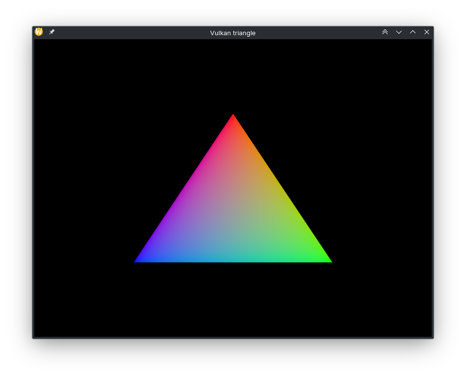

# Vulkan Triangle

This is my implementation of the [“Drawing a triangle”](https://vulkan-tutorial.com/Drawing_a_triangle/Setup/Base_code) chapter from [vulkan-tutorial.com](https://vulkan-tutorial.com). This version includes a `CMakeLists.txt` configuration that also builds the shaders automatically.

## The triangle

  

